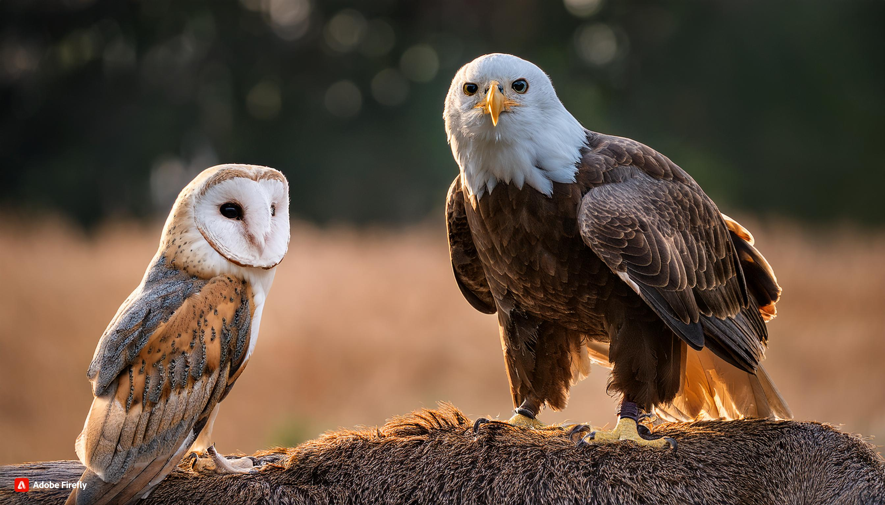

# William Ikenna-Nwosu (wiknwo)

My name is Will 😁 and this is my *developer (software, web, mobile, app)* landing page!

### Greeting: Hi there 👋🏽, I'm a founder and I...

- **Analyze data** 🧑🏽‍💻
- **Provide unique insights** 🔮🪄
- **Communicate incisively** 🗣️🗨️💻🎯
- **Untie Gordian knots** 🪢🔓
- **Shoot for the moonshots** 🔫🌚
- **Hit hidden targets** 👻🐘
- **Form community with empathy** 🤲🏽🗺️🌐

### Technologies: Craft

[**My Complete Technical Toolbox**](https://www.pinterest.com/wiknwo/my-tech-toolbox/)

#### Favorites
- **Programming Language:** Ruby
- **Image File Format:** PNG
- **Text Editor:** Microsoft Notepad
- **IDE:** Sublime Text
- **API:** OpenAlex
- **Data Format:** JSON
- **Web Browser:** Arc and probably Comet by Perplexity when it's launched
- **Search Engine:** Perplexity
- **Chatbot:** ChatGPT

#### Most Experience

- **Programming Languages:** Python, Java
- **IDE:** MSVSCODE

### Status Update: Moving at the Speed of Now

- *🔨 I'm currently building:* ...GAPRSv2.0
- *🔭 I’m currently exploring:* ...Social Media, Open-Source and Deep Learning Libraries
- *🔍 I'm currently analyzing:* ...The labor market
- *🌱 I’m currently learning:* ...About the central nervous system, muscle growth, muscle rehabilitation, muscular structural correction, strength training and ActivityPub Protocol
- *🫱🏽‍🫲🏽 I’m looking to collaborate on:* ...Fridays
- *🤔 I’m looking for help with:* ...
- *💬 Ask me about:* ...How my day is going
- *I love ❤️:* ...Khruangbin
- *📫 How to reach me:* ...Find me ❌
- *🤗 Fun fact:* ...I have friends in almost every continent and in almost every timezone. If you want to complete this then reach me and let's be friends!
